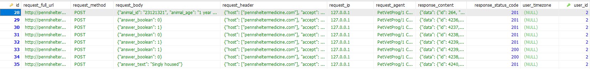

# Laravel API Logger

This is a small package that can helps in debugging api logs. It can log 
request method, url, request payload, which models are retrieved, controller and method. 



##  Installation

1. Install the package via composer

```bash
composer require tmdan/laravel-api-logger
```

## Usage

2. Publish the config file with:

```bash
php artisan vendor:publish --provider="Tmdan\ApiLogger\Providers\ApiLoggerServiceProvider"
```

3. Run commands:

```bash
php artisan migrate
```

4. Add to your .env file:

```bash
API_LOGGER_ENABLED=true
```
5. Done!